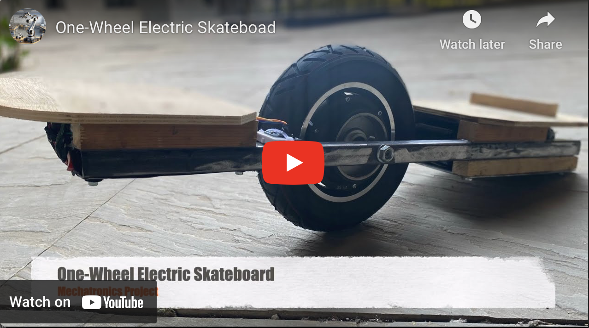
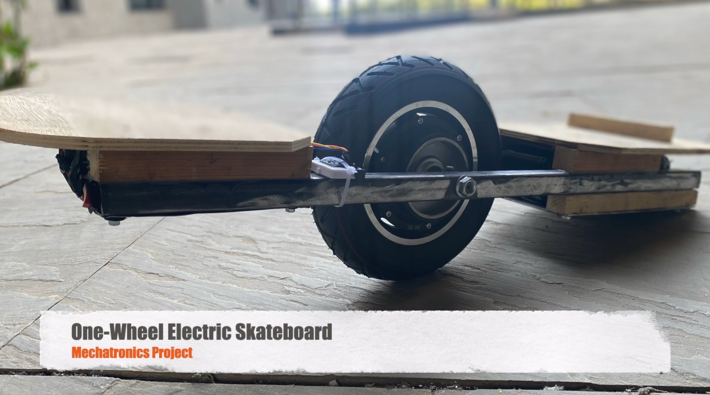
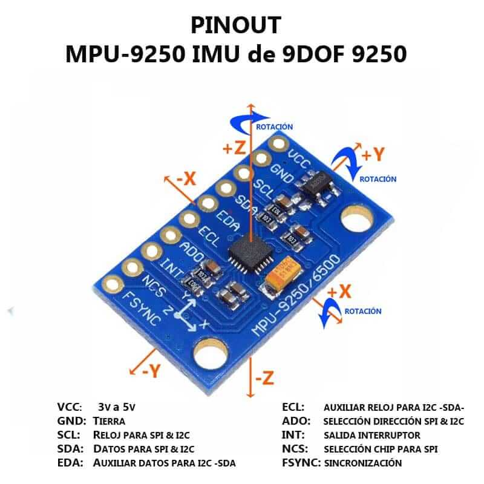
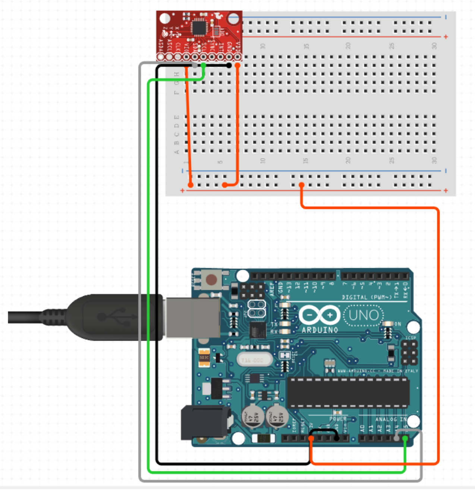

  

    <h1 align="center">One-Wheel Electric Skateboard</h1>

## Introduction
The One-Wheel Electric Skateboard, developed as a mechatronics project  exemplifies a blend of electrical and mechanical engineering concepts. This skateboard features a custom-fabricated frame, strategically designed to incorporate a hub motor, optimizing for both size and weight efficiency. Central to its operation is the integration of asensor technology, specifically an MPU9250 9-axis Inertial Measurement Unit (IMU). We employed a Kalman filter algorithm to accurately interpret the IMU data, deriving precise Euler angles essential for the skateboard's balance and control. This data plays a critical role in achieving a self-balancing mechanism akin to an inverted pendulum, accomplished through the use of interrupts and the I2C communication protocol. 

<!-- 
 -->

<!-- 
<table align="center">
  <tr>
    <td></td>
    <td></td>
  </tr>
</table> -->

## Mechanical Design 

### Parts Used
- Hollow Iron Rods
- Aluminum Sheets
- Wooden Bars
- Wooden Plates
- Battery (LIFEPO4 Rechargeable E-Vehicle Battery, 24V 12000MAH)
- IMU Sensor (MPU9250 9-Axis Gyro Accelerometer Module)
- Microcontroller (Arduino Uno)
-- Hub Motor and Motor Controller (10inch BLDC hub motor with 24V 350W motor controller)
- Switch (Single pole Single throw, SPST)

### Procedure

- Pocurement: Started with obtaining the hub motor and driver.
- Design: Developed the CAD model using Fusion 360.
- Construction: Built the mechanical structure and developed electrical circuits.
- Integration: Assembled all components into a complete system.

## Electrical Circuit

- Connection of IMU with Arduino Uno microcontroller.
- The hub motor and motor driver connection provided by venodr.
- Inclusion of a switch and battery with a basic circuit setup.
- PWM (Pulse Width Modulation) control using Arduino for the motor driver.

<table align="center">
  <tr>
    <td></td>
    <td></td>
  </tr>
</table> 

## Software Approach

#### Initialization and Setup:
- Involves initializing the Arduino code with necessary libraries.
- Sets up I2C communication and configures the MPU9250 for data transmission.

#### Data Acquisition:
- Continuously reads raw accelerometer and gyroscope data from the MPU9250.
- Processes accelerometer data to calculate the skateboard's tilt angles.

#### Kalman Filter Integration:
- Enhances angle estimation for precision in the skateboard's balancing system.
- Optimally blends accelerometer and gyroscope data for refined control.

#### Motor Control:
- Translates tilt angles into PWM signals to control the hub motor's speed.
- Adjusts motor response dynamically for smooth maneuverability and balance.

#### Dynamic Response and Balance:
- Designed to handle various tilt degrees, adjusting motor speed accordingly.
- Achieves a self-balancing mechanism akin to an inverted pendulum system.

  

#### More details of code struecture and circuit diagram can be found in the project report.
---

##  License

This project is protected under the [MIT] License. For more details, refer to the [LICENSE](https://choosealicense.com/licenses/mit/) file.

---

